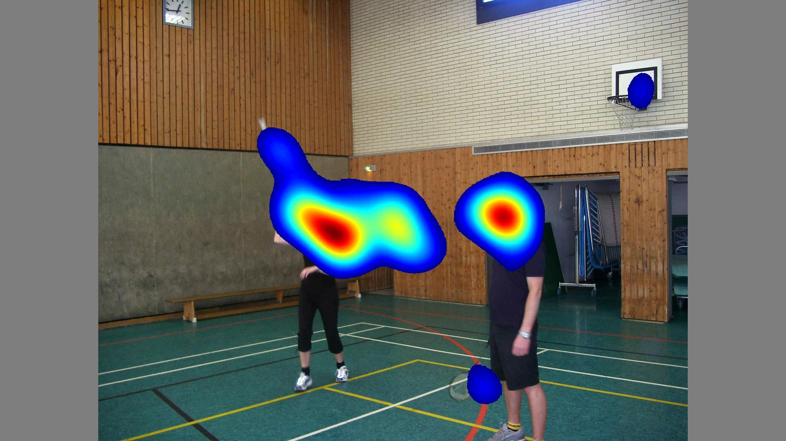

PyTorch Implementation of SalGAN: Visual Saliency Prediction with Generative Adversarial Networks
=====================================

This repository contains a PyTorch implementation of [SalGAN: Visual Saliency Prediction with Generative Adversarial Networks](https://github.com/imatge-upc/saliency-salgan-2017) by Junting Pan et al,. The model learns to predict a saliency map given an input image.

The code are mainly based on [batsa003/salgan](https://github.com/batsa003/salgan).
Thanks a lot for the great share.

Results
-------------------
TODO: We train the model on Salicon for 240 epoches. And finetune it on [CAT2000](http://saliency.mit.edu/datasets.html) for another 240 epoches. The examples can be seen below.

Test image | Prediction | Groundtruth
:-------------------------:|:-------------------------:|:-------------------------:
  |    |  

We can get CC with 0.82 and KL with 0.37 on [CAT2000](http://saliency.mit.edu/datasets.html) after finetuning.

Example Generations
-------------------
TODO: In the src/, run:
```
python predict.py
```


Training
--------
The code requires a pytorch installation.

Before you train the model, preprocess the dataset by running
```
python preprocess.py
```
to resize the ground truth images and saliency maps to 256x192.

To train the model, refer to main.py:
```
python main.py
```

WGAN-GP
--------
TODO: We also add [WGAN-GP](https://github.com/caogang/wgan-gp/) in *main.py*.

However, though the loss seems right while training, we only get blank maps.

There are still unknown bugs when training in WGAN-GP mode.

Refer to main.py for more information.

Data
----
We used the SALICON dataset for training.

We suggest you to finetune on your own dataset before testing if you want to test on a new dataset.

Reference:
---------
https://imatge-upc.github.io/saliency-salgan-2017/

https://github.com/batsa003/salgan/

https://github.com/caogang/wgan-gp/
